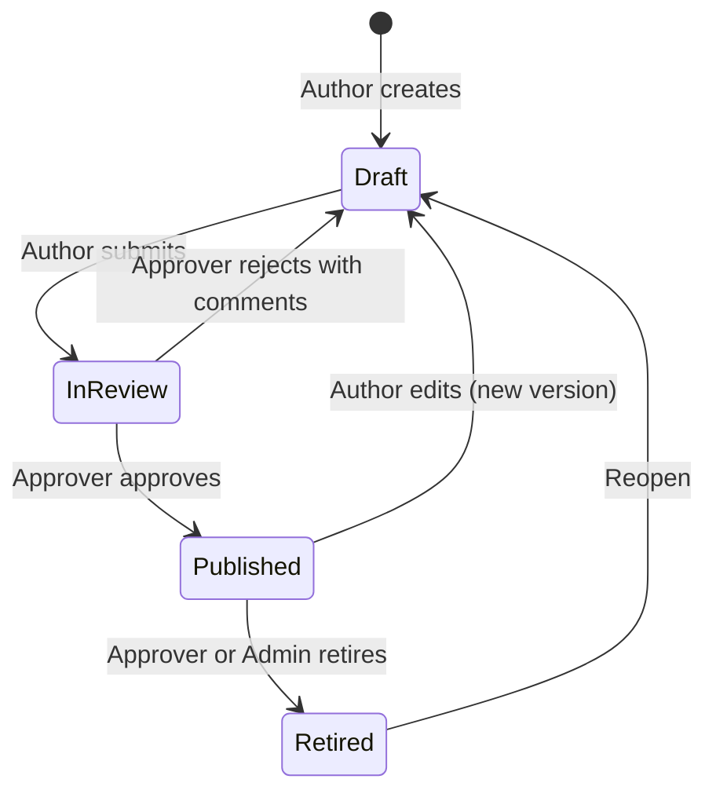
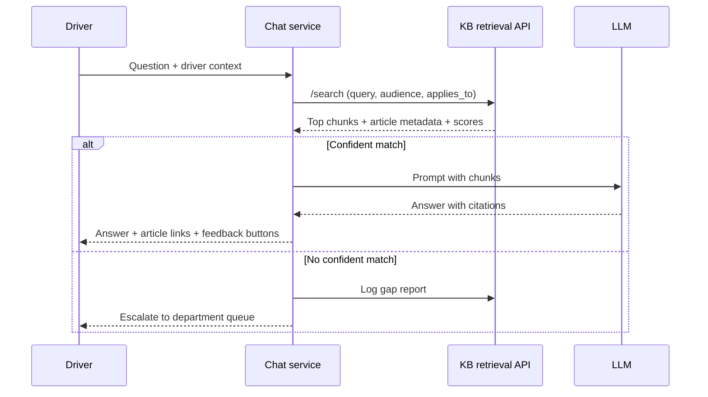

# Silvicom Knowledge Base Specification

2026-09-16 · @u_n2bzZ2LUgXMCqrNRWvLC_Q

## Purpose and scope

The knowledge base (KB) is the single source of truth that Silvicom's AI driver assistant answers from. Its job is to let the assistant resolve tier-1 driver questions ("how do I…", "what do I do when…", "who do I call…") without a human, and to hand off cleanly when it cannot.

In scope for v1:

- A structured, searchable store of support articles owned by departments (Maintenance, Safety, Dispatch, and others added over time).
- An admin/authoring UI for department SMEs to write, review, publish and retire articles.
- A retrieval API the AI chat calls to fetch relevant, permission-filtered content with citations.
- A feedback and analytics loop that surfaces unanswered questions and stale articles.

Out of scope for v1: the chat UI itself, live system data (load status, ELD hours, pay stubs), ticketing, and tier-2 workflows. The chat layer may call other Silvicom systems for live data; the KB only holds procedural and policy content.

Tier 1 here means: questions answerable from documented policy or procedure, with no account lookup and no judgment call. Anything else escalates to the department queue with the conversation transcript attached.

## Goals and success metrics

The KB succeeds when drivers get a correct, cited answer without a human for most tier-1 questions, and when unanswered questions turn into new articles within days, not months. Targets below are starting points; Silvicom should reset them after 30 days of live data.

| Metric | Definition | Target (6 months post-launch) |
| --- | --- | --- |
| Deflection rate | Driver chats resolved with no human escalation | 60% of tier-1 volume |
| Grounded-answer rate | Answers that cite at least one published article | 95% of answers |
| Answer accuracy | Sampled answers rated correct by the owning department | 95% |
| Helpful rate | Thumbs-up / (thumbs-up + thumbs-down) on answers | 80% |
| Coverage | Top driver questions (from escalations and failed searches) with a published article | 90% of top 100 |
| Freshness | Published articles past their review date | Under 5% |
| Gap-to-article time | Median days from a flagged unanswered question to a published article | 7 days |
| Retrieval latency | KB search API p95 response time | Under 500 ms |

Deflection is not one number: track it alongside escalation volume by department, so a rising deflection rate with flat ticket volume flags articles that are read but do not resolve the issue.

## Users and roles

Five roles touch the KB. Each department gets its own Author and Approver assignments; the KB Admin role is company-wide.

| Role | Who | Can do |
| --- | --- | --- |
| Driver (consumer) | Company and owner-operator drivers | Ask the AI assistant; read driver-visible articles if a direct link is shown; rate answers |
| Author | Department SMEs (e.g., a shop foreman, safety coordinator, dispatcher lead) | Create and edit drafts in their department; submit for review; respond to gap reports |
| Approver | Department manager or delegate | Approve, reject, publish and retire articles in their department; set review dates |
| KB Admin | Support/ops lead (1 to 2 people) | Manage departments, taxonomy, templates, users and roles; view all analytics; force-retire any article |
| AI assistant (service account) | The chat service | Read-only access to published articles via the retrieval API, filtered by the asking driver's audience |

Support agents handling escalations should also have Author rights in at least one department, so a resolved escalation can become a draft article in one step (the Knowledge-Centered Service pattern: capture knowledge as part of solving the case).

## Content model

The unit of content is an Article: one question or task, one answer, one owner. Articles carry structured metadata so the retrieval layer can filter before it searches. Body content is stored as Markdown (headings, numbered steps, tables, links); no free-form HTML, no embedded images without alt text.

### Article fields

| Field | Type | Required | Notes |
| --- | --- | --- | --- |
| id | UUID | yes | Stable across versions |
| slug | string | yes | URL-safe, unique, generated from title |
| title | string (max 120) | yes | Written as the driver's question or task, e.g. "What do I do if the truck won't start?" |
| summary | string (max 300) | yes | The short answer; used in search results and as the first chunk |
| body | Markdown | yes | Full answer; see Authoring guidelines |
| article\_type | enum | yes | faq, how\_to, troubleshooting, policy, contact, glossary |
| department\_id | FK | yes | Owning department |
| categories | FK\[\] | yes | One or more from that department's category tree |
| tags | string\[\] | no | Free-form synonyms and driver slang ("breakdown", "road call", "PM") |
| audience | enum\[\] | yes | driver\_company, driver\_owner\_operator, internal\_only |
| applies\_to | JSON | no | Structured scope: regions, terminals, equipment types, fleet segments |
| status | enum | yes | draft, in\_review, published, retired |
| version | int | yes | Increments on every published change |
| owner\_user\_id | FK | yes | Accountable person |
| approver\_user\_id | FK | published only | Who approved this version |
| effective\_from | date | no | For policy changes announced ahead of time |
| review\_due | date | yes | Next scheduled review; defaults by article\_type |
| related\_article\_ids | UUID\[\] | no | For "see also" and for the assistant to pull adjacent context |
| escalation\_target | FK | no | Which department queue the assistant escalates to if this article does not resolve the issue |
| source\_refs | string\[\] | no | Links or document IDs of the policy/manual the article was written from |
| created\_at, updated\_at, published\_at, retired\_at | timestamp | yes/auto | Audit trail |

### Article types

| Type | Shape | Example |
| --- | --- | --- |
| faq | One question, one direct answer | "How many hours before a 30-minute break is required?" |
| how\_to | Numbered steps with a stated end result | "How to submit a fuel receipt in the driver app" |
| troubleshooting | Symptom, then if/then checks, then when to escalate | "Check engine light came on" |
| policy | Rule, who it applies to, exceptions, consequences | "Idling policy" |
| contact | Who to call, when, and what info to have ready | "Reaching the after-hours breakdown line" |
| glossary | Term and definition | "What is a PM?" |

### Supporting entities

- Department: id, name, code, escalation queue, default review interval, active flag.
- Category: id, department\_id, parent\_id, name, order. Two levels deep max.
- Article version: immutable snapshot of every published version (title, body, metadata, approver, timestamp) for audit and rollback.
- Attachment: id, article\_id, file, alt\_text, mime type. Images and PDFs only; the assistant answers from text, so any critical fact in an image must also be in the body.
- Gap report and Feedback: see the feedback section.

The assistant never reads draft, in\_review or retired content. Only the current published version of each article is indexed.

## Departments and taxonomy

Departments are data, not code: the KB Admin adds one through the admin UI with a name, code, escalation queue and default review interval, and it is live immediately. Categories under each department are kept flat (two levels max) because deep trees make authors guess where an article belongs and make filters noisy.

Starting taxonomy, to be confirmed with each department head:

| Department | Code | Starter categories | Default review interval |
| --- | --- | --- | --- |
| Maintenance | MNT | Breakdowns and road calls; Preventive maintenance and PM scheduling; Pre-trip and post-trip inspections; Defect reporting and DVIR; Tires, brakes, lights; Trailers and reefers; Shop locations and hours | 180 days |
| Safety | SFT | Hours of service; Accident and incident reporting; Drug and alcohol testing; Cargo securement; Weather and road conditions; Equipment (PPE, cameras, ELD); Training and certifications | 90 days (regulatory) |
| Dispatch | DSP | Load assignment and acceptance; Pickup and delivery procedures; Detention and layover; Route changes and delays; Communication with dispatch; After-hours contacts | 90 days |
| Payroll and settlements | PAY | Pay schedule; Per diem and reimbursements; Fuel cards and receipts; Settlement disputes | 90 days |
| HR and benefits | HR | Time off; Benefits enrollment; Policies and conduct; Onboarding | 180 days |
| Compliance and permits | CMP | Permits and IFTA; Scales and inspections; Documentation in cab | 90 days |
| IT and driver app | IT | Login and password; App errors; ELD device issues | 90 days |

Cross-department rules:

- An article has exactly one owning department, even when the topic spans two. The owner links to the other department's article through related\_article\_ids rather than duplicating content. Duplicate or conflicting articles are the main cause of wrong AI answers.
- Tags are shared across departments and managed by the KB Admin as a synonym list, so "road call", "breakdown" and "truck died" all resolve to the same content.
- applies\_to scope (region, terminal, equipment type, fleet segment) is a filter on top of taxonomy, not a category. A Chicago-terminal-only procedure is still under Maintenance > Shop locations, scoped to that terminal.

## Authoring guidelines

Articles are written for a language model to read and a driver to hear back, so each article must be self-contained, unambiguous and about one thing. The admin UI enforces the structure through per-type templates and a pre-publish checklist.

Rules the template and checklist enforce:

1. Title is the question a driver would actually ask, in their words ("My fuel card got declined" beats "Fuel card authorization failure").
2. Summary gives the answer in one to three sentences. The assistant will often answer from the summary alone.
3. One topic per article. If an article needs "if you are a company driver… / if you are an owner-operator…" branches for more than a few lines, split it and use the audience field.
4. Every step is concrete: name the app screen, the phone number, the form, the time limit. "Contact dispatch" is not a step; "Call dispatch at \[number\], option 2, and give your truck number" is.
5. State the outcome and the fallback: what the driver should see when it worked, and what to do (and whom to contact) if it did not.
6. No pronouns without a referent, no "as above", no "see the manual" without linking the article that covers it. Each chunk may be retrieved on its own.
7. Numbers, limits and deadlines are written out and dated ("as of Sept 2026, detention pay starts after 2 hours"). If a value changes often, link to the live source instead of hardcoding it.
8. Plain language: short sentences, no internal acronyms without expansion on first use, reading level around 6th to 8th grade. Content will be translated, so avoid idioms.
9. Do not put policy in images, PDFs or tables that lose meaning without formatting. Attachments support the text; they do not replace it.
10. Never include personal data (driver names, phone numbers of individuals, license numbers) in article bodies. Department contact numbers are fine.

Pre-publish checklist (blocking): title is a question or task; summary present; one department, at least one category, at least one audience; review\_due set; escalation\_target set for troubleshooting and how\_to types; no duplicate title within the department (fuzzy match warning); no links to draft or retired articles.

## Content lifecycle and governance

Every article moves through four states, and only Published content reaches the assistant. Editing a published article creates a new draft version; the live version stays up until the new one is approved.

Reading: an Approver cannot approve their own draft; the system requires a second person for any Safety or Compliance article.

Governance rules:

- Ownership: no article exists without an owner\_user\_id and a review\_due date. When an owner leaves or changes role, their articles are reassigned by the Approver before the account is deactivated (the system blocks deactivation until this is done).
- Review cadence: change-driven first, calendar second. A published article is flagged for review when its review\_due passes, when a linked source\_ref changes (manual upload of a new policy version), when its helpful rate drops below 60% over 30 days, or when it appears in 3 or more escalations in a week. Reviews are triggered, not left to memory.
- Expiry: an article 30 days past review\_due with no action is automatically marked "stale" and the assistant adds a caveat to answers drawn from it; 60 days past, it is auto-retired and the owner and Approver are notified. This is the guardrail against confidently wrong answers.
- Versioning: every published version is immutable and diffable. Rollback to any prior version is one action for an Approver.
- Audit: who created, edited, approved, published, retired, and when, is recorded per version and exportable. Safety and Compliance need this for DOT audits.
- Retire, don't delete: retired articles stay searchable in the admin UI and keep their id, so old escalation transcripts still resolve.
- Effective dating: a policy article with effective\_from in the future is published but not served until that date; the previous version serves until then.

## AI retrieval layer

The assistant answers only from retrieved, published, audience-filtered chunks, and every answer carries citations. Retrieval quality sets the ceiling on answer quality, so this layer is specified in more detail than the chat itself.

Reading: the KB owns search and logging; the chat service owns prompting and the escalation decision.

Indexing (runs on every publish, retire, or version change):

- Chunking: split on Markdown headings, then by paragraph, targeting 200 to 500 tokens per chunk with a 10 to 15% overlap. Numbered step lists stay together in one chunk when under the limit. Tables are chunked as whole tables with their heading.
- Chunk context: every chunk is prefixed with the article title, department, category and summary before embedding, so a mid-article step still retrieves for the right question.
- Chunk metadata (stored beside the vector): article\_id, version, department\_id, categories, audience, applies\_to, article\_type, published\_at, review\_due, stale flag.
- Hybrid search: dense vector search plus keyword (BM25) search, merged with reciprocal rank fusion, then an optional cross-encoder rerank of the top 20. Keyword search matters here because driver questions contain exact tokens (form names, error codes, truck numbers) that embeddings blur.
- Filters run before ranking: audience must match the driver, applies\_to must match or be empty, status must be published, effective\_from must be past.
- Query handling: expand with the shared synonym list; strip driver PII (truck number, name) before logging.
- Full re-index is idempotent and can rebuild from the article store at any time; the vector index is derived data, never the source of truth.

Response contract for the chat service:

- Return top 5 chunks with score, article\_id, title, slug, version, chunk text and a confidence band (high, medium, low) derived from score gap and absolute threshold.
- Below the low threshold, return no chunks and a reason code (no\_match, out\_of\_scope, stale\_only) so the chat escalates instead of guessing.
- Every answer the chat sends must cite article ids; the KB records which article versions were served in each answer for later accuracy review.

Embedding model and vector store are implementation choices for the developers. The requirement is that the model can be swapped with a full re-index, and that the store supports metadata filtering before vector search.

## Gap detection and feedback loop

The KB grows from what drivers actually ask, so every miss is captured as a work item for the owning department. This loop is what turns a static library into automated tier-1 support.

Gap report (created automatically):

| Field | Notes |
| --- | --- |
| id, created\_at |  |
| trigger | no\_match, low\_confidence, escalated\_after\_answer, thumbs\_down |
| question\_text | Driver's question with PII stripped |
| suggested\_department | Classified by the chat service; editable |
| served\_article\_ids | What the assistant cited, if anything |
| escalation\_ticket\_id | Link to the ticket if it escalated |
| status | new, in\_progress, resolved\_new\_article, resolved\_updated\_article, dismissed |
| assigned\_to | Author in the suggested department |
| cluster\_id | Similar questions grouped so one article closes many gaps |

Rules:

- Gap reports are clustered nightly by embedding similarity; the admin UI shows clusters ranked by count over the last 30 days, per department. Authors work the top of the list.
- Creating an article from a gap report pre-fills the title with the driver's question and links the report; publishing closes it.
- Answer feedback: thumbs up/down with an optional reason (wrong, outdated, not what I asked, could not follow). Thumbs-down on the same article version 3 times in 7 days flags it for review.
- Human agents closing an escalation must pick: existing article was correct (retrain/prompt issue), article needs update (opens a draft), or no article exists (opens a gap report).

Analytics dashboard, per department and company-wide, over selectable date ranges:

- Questions asked, answered, escalated; deflection rate; helpful rate.
- Top 50 questions and top 50 unanswered clusters.
- Articles by status, stale count, overdue reviews, articles with zero retrievals in 90 days (candidates to retire or retitle).
- Answer accuracy sample: a weekly random sample of 20 answers per department is queued for the Approver to grade correct/incorrect; the grade feeds the accuracy metric.

## Access control and security

Drivers only ever see content tagged for their audience, and the KB never stores driver personal data. Authoring rights are scoped by department.

- Authentication: admin UI and APIs use Silvicom's existing identity provider (SSO); the assistant uses a service account with a read-only scope. Driver identity comes from the chat service, which passes audience and applies\_to claims per request; the KB does not look drivers up.
- Authorization: Author and Approver rights are granted per department; KB Admin is global. A user can hold roles in several departments.
- Audience enforcement happens in the retrieval filter, not in the prompt. internal\_only articles (agent playbooks, escalation scripts) are never returned to the assistant's driver-facing calls.
- PII: question logs and gap reports are scrubbed of names, phone numbers, license and truck numbers before storage. Article bodies are scanned for the same patterns on submit and blocked.
- Audit log: every read of internal\_only content and every write is logged with user, timestamp and article version; retained 3 years (align with Safety's DOT record retention).
- Data at rest and in transit encrypted; backups daily; the vector index is rebuildable so only the article store needs point-in-time recovery.

## Integration and APIs

The KB exposes three API surfaces: an admin API behind the authoring UI, a retrieval API for the assistant, and a webhook/event feed for analytics and ticketing. All are versioned REST with JSON; auth via bearer tokens scoped by role.

| Endpoint | Consumer | Purpose |
| --- | --- | --- |
| POST /v1/search | Chat service | Query + audience + applies\_to filters; returns ranked chunks, metadata, confidence band, reason code |
| GET /v1/articles/{id} | Chat service, admin UI | Full published article for "show me the full procedure" or link rendering |
| POST /v1/answers | Chat service | Record which article versions were cited in an answer (for accuracy sampling) |
| POST /v1/feedback | Chat service | Thumbs up/down + reason, tied to an answer id |
| POST /v1/gaps | Chat service, ticketing | Create a gap report from a miss or an escalation |
| CRUD /v1/admin/articles, /categories, /departments, /tags, /users | Admin UI | Authoring, taxonomy and role management |
| POST /v1/admin/articles/{id}/submit, /approve, /reject, /publish, /retire, /rollback | Admin UI | Lifecycle transitions with comments |
| POST /v1/admin/import | Admin UI | Bulk import from Markdown, DOCX or PDF into drafts (see below) |
| GET /v1/admin/analytics/... | Admin UI | Dashboard queries |
| Webhooks: article.published, article.retired, article.stale, gap.created | Ticketing, Slack/Teams, chat service cache | Event feed |

Initial content load: most department knowledge exists today as PDFs, Word files, handbook sections and people's heads. The import tool converts a document into one or more draft articles (one per heading section), keeps the source file as source\_refs, and routes them to the department's Authors for cleanup. Nothing imported is published without passing the checklist. Expect the first pass to be 60% rewriting: handbook prose is not question-shaped.

Ticketing: when the assistant escalates, the chat service creates the ticket; the KB only needs the ticket id back on the gap report. Ticket closure reasons flow back through POST /v1/gaps.

## Non-functional requirements

| Area | Requirement |
| --- | --- |
| Performance | /v1/search p95 under 500 ms at 50 concurrent requests; publish-to-searchable under 2 minutes |
| Availability | 99.9% for the retrieval API (drivers ask at 2 a.m. on the shoulder); admin UI 99.5% |
| Scale | 5,000 articles, 100,000 chunks, 10,000 questions/day without re-architecture |
| Multilingual | Article body stored in a primary language with optional translations per language code; search embeds cross-lingually so a Spanish question matches an English article; the chat answers in the driver's language. Spanish first, others as data |
| Mobile | Admin UI usable on tablet; driver-facing article view renders on phone; the assistant answer is the primary surface, not the article page |
| Offline | Out of scope; the chat service may cache the top 200 articles for degraded mode |
| Accessibility | WCAG 2.1 AA for the article view; alt text required on attachments |
| Observability | Search latency, no-match rate, stale-served count and index lag as first-class metrics with alerts |
| Evaluation | A golden set of at least 200 driver questions with expected articles, run on every index or model change; retrieval recall@5 must not drop below 90% |

## Phased rollout

Start with one department and the top 50 questions, prove deflection, then add departments as data rather than as projects.

| Phase | Scope | Exit criteria |
| --- | --- | --- |
| 0. Discovery (2 to 3 weeks) | Pull the last 6 months of driver calls, texts and tickets; cluster into top 100 questions per department; confirm taxonomy and owners | Ranked question list signed off by each department head |
| 1. Foundation (6 to 8 weeks) | Article store, admin UI, lifecycle, one department (Dispatch, highest volume), retrieval API, golden set | 50 published Dispatch articles; recall@5 at or above 90% on the golden set |
| 2. Pilot (4 weeks) | Assistant live for a pilot group of drivers on Dispatch questions only; gap loop and feedback active | Deflection above 40% on pilot traffic; accuracy above 90% on sampled answers |
| 3. Expand (rolling, 3 to 4 weeks per department) | Safety, then Maintenance, then Payroll and others; import tool for legacy docs | Each department reaches 90% coverage of its top 100 questions before its traffic is routed to the assistant |
| 4. Steady state | Weekly gap review per department; monthly accuracy sample; quarterly taxonomy review | Metrics in the Goals section met and held for 60 days |

## Open questions for Silvicom

Answers to these change the design in specific places; defaults are noted so development can start.

- [ ] Driver population: company drivers only, or owner-operators too? Default: both, as separate audiences.
- [ ] Channels: is the assistant in the existing driver app, SMS, phone (voice), or all? Voice changes article length limits and citation display.
- [ ] Languages needed at launch. Default: English and Spanish.
- [ ] Which departments beyond Maintenance, Safety and Dispatch, and who owns each? Default list is in the taxonomy section.
- [ ] Where does live data come from (load status, HOS, pay)? The assistant will need those integrations; the KB deliberately does not hold them.
- [ ] Existing ticketing or CRM the escalations should land in.
- [ ] Regional or terminal differences in procedure: how many, and do they justify applies\_to scoping in v1?
- [ ] Approval rule: is a second approver for Safety and Compliance acceptable, or does every department want one?
- [ ] Retention period for question logs and audit trails. Default: 3 years.
- [ ] Build vs. buy for the vector search and admin UI components; this spec assumes homegrown throughout.

### Sources consulted

- [The RAG Playbook: Structuring Scalable Knowledge Bases](https://www.regal.ai/blog/rag-playbook-structuring-knowledge-bases)
- [Optimizing Knowledge Bases for Effective RAG Pipelines](https://unstructured.io/insights/knowledge-base-optimization-for-enterprise-rag-pipelines)
- [AI Chatbot Knowledge Base: Best Practices for Accuracy](https://hyperleap.ai/blog/ai-chatbot-knowledge-base-best-practices)
- [KB Governance Cadence: Owners and Reviews](https://www.supportbench.com/kb-governance-cadence-owners-reviews-expiry-archives/)
- [Salesforce Knowledge Base Strategy: Articles, Governance, Deflection](https://www.fastslowmotion.com/salesforce-knowledge-base-strategy/)
- [ServiceNow Knowledge Base Best Practices](https://www.screenmeet.com/blog/servicenow-knowledge-base-best-practices)
- [Knowledge Base Best Practices](https://knowledge-base.software/guides/best-practices/)
- [Engineering the RAG Stack (arXiv review)](https://arxiv.org/pdf/2601.05264)
